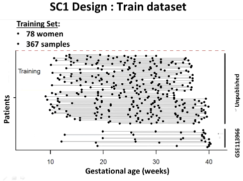

# ai4all2019_bio

invent the future ai4all is a 2 week summer enrichment program for grad 10 & 11 girls

links:
- drive (see description below): https://drive.google.com/drive/folders/1YmWcwDZ4f5B1ajF90gEeKbE60hN1-uBL?usp=sharing
- challenge site: https://www.synapse.org/#!Synapse:syn18380862
- ai4all sfu site: https://www.sfu.ca/computing/inventthefuture.html
  - pitches: https://docs.google.com/document/d/1Co6ZALQjFdeEKPGSlvAxB0TqsAt0ZTLrqT8J77VPp2o/edit

scripts:
- [bio2019_all.R](bio2019_all.R): script that generates all features and model results; section on feature generation taken from [bio2019_FeatureExtraction.R](bio2019_FeatureExtraction.R)
  - ```models``` variable contains all the models used from the ```caret``` package; details can be found on https://topepo.github.io/caret/available-models.html
  - ```pars``` variable contains all the parameters to test on these models, only the parameters with the best RMSE is kept
- [bio2019_loadtest.R](bio2019_loadtest.R): script that loads and displays results of each feature/model combination one by one as defined by variables ```xi``` (feature) and ```model```

## schedule

meetings:
- 2019-05-09 15:00 mentor's startup meeting ([ppt](ITF2019-MentorWelcome.pptx), 
[pdf](ITF2019-MentorWelcome.pdf), [project ideas](https://sfu-db.github.io/bigdata-cmpt733/final-project-sp19.html))
- 2019-05-17 11:00 project pitch ([bio ideas](https://docs.google.com/document/d/1v7Q5Cw732rBZHirZqWpQawUZO749UbMYdlv1ElbI2ZI/edit?usp=sharing))
- 2019-05-22 10:00 pregnancy project webinar ([vod](https://drive.google.com/file/d/1O1ESxtGLoKHPRJI9HIY5SSNNUBKrlUx-/view?usp=sharing))
- 2019-05-28 15:30 refined [project pitch](https://docs.google.com/document/d/1Co6ZALQjFdeEKPGSlvAxB0TqsAt0ZTLrqT8J77VPp2o/edit)
- 2019-06-28 project code ready
- 2019-07-03 test code on laptops
- 2019-07-10 install environment

program:
- 2019-07-19 afternoon project group preferences
- 2019-07-{22:26}\24 project time & event

challenge:
- 2019-05-04 sub-challenge 1 open
- 2019-05-22 sub-challenge 1 leaderboard (max 5 submissions)
- 2019-08-15 sub-challenge 1 deadline for submission; 2019-09-13 results announced, 219-11-04 RSG with DREAM conference
- 2019-08-15 sub-challenge 2 open + leaderboard (max 5 submissions)
- 2019-12-05 sub-challenge 2 deadline for submission; 2020-01-03 results announced


## project: sub-challenge 1 - gestational age prediction

Preterm birth (birth on or before 37 weeks of gestation) affects 15 million neonates per year and is the leading cause of infant morbidity and mortality. To understand whether or not a woman and her child is at risk of and design interventions to prevent preterm birth, clinicians require two key information points: gestational age and the condition of the fetus in relation to that gestational age. These help to time care, schedule/interpret antepartum tests, and evaluate fetal growth, and thus possibly prevent preterm birth. 

Gestational age is currently determined by timing a woman’s last menstrual period or by ultrasound. The former is the most reliable metric thus far, but can be inaccurate and subjective based on how a patient self manages her pregnancy. The latter is objective but is costly and less accurate if done prior to 14 weeks of pregnancy. An objective, noninvasive and less costly method to determine gestational age is by analyzing maternal whole-blood transcriptomics.

Transcriptomics is a technology that studies an organism’s transcriptome. The transcriptome encompassess all the RNA transcripts (more specifically messenger or mRNA’s) created by replicating different genes in the genome. These RNA fragments are subsequently translated into proteins used to perform biological functions. In other words, transcriptomics is a study of how active each gene is in contribution to a biological state based on how many times mRNA fragments mapping to each gene occur within a sample.

The clinical question here is then: what maternal whole-blood mRNA genes/probe/isoforms can be used to accurately determine gestational age. This result can guide more practical and less expensive whole-blood transcriptomic tests that target specific genes and their expression profiles. Computationally, the questions is then to determine what model can best produce accurate results while maintaining interpretability of which genes or features contribute to those results.

This project is based on sub-challenge 1 of the preterm birth prediction (transcriptomics) challenge ([link](https://www.synapse.org/#!Synapse:syn18380862)). It expands on a previous paper (GSE113966 DOI: 10.1126/science.aar3819 [pdf](GSE113966.pdf), [supplement](GSE113966_supp.pdf)) by utilizing a larger data set with heterogeneous patients (samples from women who 1. gave normal birth, 2. had early preeclampsia, and 3. spontaneous preterm delivery or rupture membrane; versus normal birth subjects only), genome-wide (versus targeted gene), whole-blood (versus cell-free mRNA) transcriptomics etc.

The students will be familiarized with the transcriptomics data type, how they can be preprocessed and used to predict a continuous outcome. Students will be able to learn about how machine learning pipelines are engineered, broad machine learning algorithms, and how they can be used in application to real world problems -- in this case to create equal and inclusive quality care for women whom we may not have gestational age information on.

Key Learning Opportunities
- Data preprocessing: feature selection, dimensionality reduction, de-noising
- Model construction: for predicting continuous value gestational age in weeks
- Model evaluation: root mean-square error etc.
- Interpretation techniques: extract important features and visualize their inter-relations and relation with results

Deliverables
- Domain knowledge: demonstrate ability to understand and communicate purpose, methods, results, implications, and possible extensions of the project
- Computational knowledge: recognize generalizability of each method used in pipeline and how they can be engineered and customized for specific data sets
- Project results: good feels


### drive/data/00_input
- input: ```HTA20_RMA.RData```
- output: 5 submissions to leaderboard, 1 final submission; continuous 8-42 gestational age in weeks rounded to 1 decimal for test sample
- evaluation: RMSE (root mean-square error)
- ```HTA20_RMA.RData```: maternal whole-blood preprocessed **(32830/925032 gene/probeset x 367 train + 368 test samples)** expression matrix
  - rownames: ENTREZ-gene(except for “_at” suffix)/probeset IDs
  - colnames: SampleID
- ```anoSC1_v11_nokey.csv```: sample annotation file with the following columns
  - SampleID: unique identifier of the sample (matching the name of the .CEL file in HTA20 folder, except for extension .CEL);
  - GA: gestational age as determined by the last menstrual period and or ultrasound; 
  - Batch: the batch identifier; 
  - Set: name of the source dataset; 
  - Train: 1 for samples to be used for training, 0 for samples to be used for test; 
  - Platform: gene expression platform used to generate the cell files.
- ```preprocess_data_SC1.R```: generates gene level and probeset (exon and exon-junction) level data ```HTA20_RMA.RData``` from raw (.CEL) files
  - obtained using the RMA implemented in the oligo package of Bioconductor
  - probsets based on a chip definition file generated from the ```pd.hta20.hs.entrezg_0.0.1.tar.gz``` annotation data from http://brainarray.mbni.med.umich.edu; annotation package pd.hta.2.0 (v 3.12.2) from Bioconductor can be used to map probesets to gene identifiers
  - processed separately for each of the 11 experimental batch profiling train + test samples being profiled in each batch
  - then combined across batches 
  - quantile normalized
  - batch effect removal using the ```removeBatchEffects``` from the limma package of Bioconductor
- ```pd.hta20.hs.entrezg_0.0.1.tar.gz```: annotation package used to generate gene level expression data.
- ```HT20``` folder (not uploaded 47.36gb): 735 raw .CEL files from the HTA 2.0 platform




### drive/data/01_features

this folder contains features transformed from ```HTA20_RMA.RData```

### drive/data/02_models

all models tested are saved here organized by feature used; these are loaded back into scripts to generate visualizations and tables

### drive/data/03_results

resulting visualizations and tables are saved here

### drive/data/cvinds.Rdata

indices used for cross validation in training, and testing


